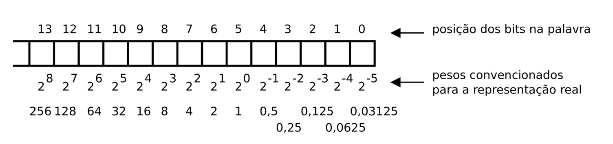
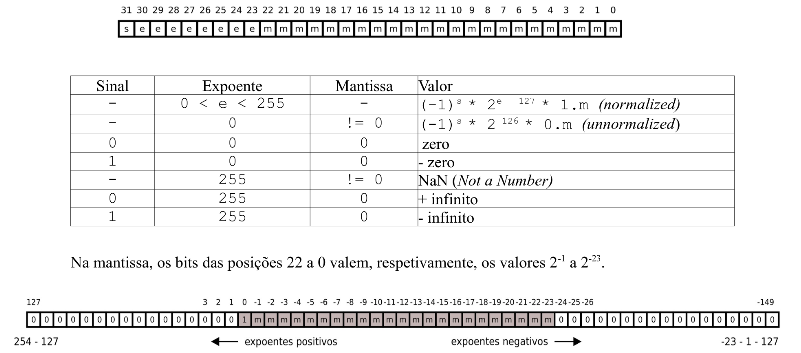
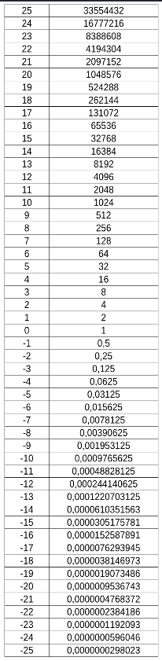

# Linguagem C - valores e expressões

## Tipos básicos

### char int float double

| C  | x86_64 | ia-32 | Java | Kotlin |
| -- | ------ | ----- | ---- | ------ |
| char | 8 | 8 | 8 (byte) | 8 (Byte) |
| short int | 16 | 16 | 16 (short) | 16 (Short) |
| int | 32 | 32 | 32 (int) | 32 (Int) |
| long int | 64 | 32 | 64 (long) | 64 (Long) | 
| long long int | 64 | 64 |  |  |
| float | 32 | 32 | 32 (float) | 32 (Float) |
| double | 64 | 64 | 64 (double) | 64 (Double) |
| long double | 128 | 128 | |  | |
| |  |  | 16 (char) | 16 (Char) |
| |  |  | boolean | Boolean |

Na linguagem C, os valores do tipo **char** são considerados valores númericos.

Modificadores de dimensão:

- **short**
- **long**

Modificadores de sinal:

- **signed**
- **unsigned**

A palavra **int** pode ser omitida quando se usa um modificador, ex. **short** é o mesmo que **short int**

Operador **sizeof** - devolve a dimensão de uma variável ou tipo. A unidade de medida é a dimensão do tipo **char**.

Dimensões definidas pela especificação da linguagem C para cada tipo:

- **char** >= 8 bit
- **short** >= 16 bit
- **int** >= 16 bit
- **long** >= 32 bit

**sizeof(char)** <= **sizeof(short)** <= **sizeof(int)** <= **sizeof(long)** <= **sizeof(long long)**

**sizeof(float)** <= **sizeof(double)** <= **sizeof(long double)**

A linguagem C não define a representação interna dos *float*. A norma [IEE754](https://en.wikipedia.org/wiki/IEEE_754) é a mais utilizada.

Na linguagem C, uma expressão pode envolver valores numéricos de tipos diferentes, acontecendo conversão explícita dos valores dos tipos menores para valores de tipos maiores, antes de serem operados.

### Limites

No ficheiro ```/usr/include/limits.h``` encontram-se declarados os simbolos que representam os valores limites de cada tipo. Estes valores podem ser diferentes entre sistemas.

```C
/* Number of bits in a `char'.	*/
#  define CHAR_BIT	8
/* Minimum and maximum values a `signed char' can hold.  */
#  define SCHAR_MIN	(-128)
#  define SCHAR_MAX	127
/* Maximum value an `unsigned char' can hold.  (Minimum is 0.)  */
#  define UCHAR_MAX	255
/* Minimum and maximum values a `char' can hold.  */
#  ifdef __CHAR_UNSIGNED__
#   define CHAR_MIN	0
#   define CHAR_MAX	UCHAR_MAX
#  else
#   define CHAR_MIN	SCHAR_MIN
#   define CHAR_MAX	SCHAR_MAX
#  endif
/* Minimum and maximum values a `signed short int' can hold.  */
#  define SHRT_MIN	(-32768)
#  define SHRT_MAX	32767
/* Maximum value an `unsigned short int' can hold.  (Minimum is 0.)  */
#  define USHRT_MAX	65535
/* Minimum and maximum values a `signed int' can hold.  */
#  define INT_MIN	(-INT_MAX - 1)
#  define INT_MAX	2147483647
/* Maximum value an `unsigned int' can hold.  (Minimum is 0.)  */
#  define UINT_MAX	4294967295U
/* Minimum and maximum values a `signed long int' can hold.  */
#  if __WORDSIZE == 64
#   define LONG_MAX	9223372036854775807L
#  else
#   define LONG_MAX	2147483647L
#  endif
#  define LONG_MIN	(-LONG_MAX - 1L)
/* Maximum value an `unsigned long int' can hold.  (Minimum is 0.)  */
#  if __WORDSIZE == 64
#   define ULONG_MAX	18446744073709551615UL
#  else
#   define ULONG_MAX	4294967295UL
#  endif
#  ifdef __USE_ISOC99
/* Minimum and maximum values a `signed long long int' can hold.  */
#   define LLONG_MAX	9223372036854775807LL
#   define LLONG_MIN	(-LLONG_MAX - 1LL)
/* Maximum value an `unsigned long long int' can hold.  (Minimum is 0.)  */
#   define ULLONG_MAX	18446744073709551615ULL
#  endif /* ISO C99 */
```

### Portabilidade - stdint

Se se pretender portabilidade entre sistemas diferentes terá de se prestar atenção ao domínio de valores dos tipos utilizados.

Uma forma de garantir a mesma dimensão para os tipos básicos em sistemas diferentes, é usar os tipos com dimensão explícita, definidos em **stdint.h**

- int8_t
- int16_t
- int32_t
- int64_t
- uint8_t
- uint16_t
- uint32_t
- uint64_t

### Modificadores **U** e **L** em constantes

Por omissão uma constante é do tipo **int**. Os sufixos **U** e **L** modificam o tipo da constante para **unsigned** e **long** respetivamente

- **3U** representa o valor 3 do tipo **unsigned int**
- **3UL** representa o valor 3 do tipo **unsigned long int**
    * ```long d = 1L << 31;``` resulta no valor 2147483648
    * ```long e = 1 << 31;``` resulta no valor -2147483648
    * ```int f = (1 << 31) >> 31;``` resulta no valor -1
    * ```int f = (1U << 31) >> 31;``` resulta no valor 1


## Valores reais

### Representação em virgula fixa

Os números reais podem ser representados em base binária usando as mesmas regras de significância posicional usadas em base decimal.

Por exemplo, ```23.625``` representa em base decimal o mesmo valor que ```10111.101``` em base binária.

Em base decimal, as posições representadas valem respetivamente 10^1^ (10), 10^0^ (1), 10^-1^ (0.1), 10^-2^ (0.01) e 10^-3^ (0.001).

Em base binária, as posições representadas valem respetivamente 2^4^ (16), 2^3^ (8), 2^2^ (4), 2^1^ (2), 2^0^ (1), 2^-1^ (0.5), 2^-2^ (0.25), 2^-3^ (0.125).



### Representação em vírgula flutuante (formato IEEE 754)



**Exemplo**

1 10000101 110110101000000000000

- sinal: -1
- expoente: 133
- mantissa: 110110101
    * 2^-1^ + 2^-2^ + 2^-4^ + 2^-5^ + 2^-7^ + 2^-9^
    * 0.5 + 0.25 + 0.0625 + 0.03125 + 0.0078125 + 0.001953125 = 0.853515625
- valor representado: (-1) 1 x 2^133-127^ x 1.853515625 = **-118.625**

**Constantes**

|        | Dim. total | Dim. mantissa | Dim. Expoente |        |
| ------ | ---------- | ------------- | ------------- | -------|
| float  |     32     |      23       |       8       | 23.5F 123.45e10F |
| double |     64     |      52       |       11      | 23.5 123.45e10 |
| long double | 128   |     113       |       15      | 23.5L 123.45e10L |

**Limites - float.h**

- Maior magnitude codificável
    * 0 11111110 111 1111 1111 1111 1111 1111
    * 2^254-127^ * (1.11111111111111111111111)
    * 3.4028234663852885981170418384516925e+38F
- Menor magnitude codificável
    * 1 00000001 000 0000 0000 0000 0000 0000
    * 2^1-127^ * (1.00000000000000000000000)
    * 1.17549435082228750796873653722224568e-38F
- Maior magnitude sem erro
    * 0 10010110 111 1111 1111 1111 1111 1111
    * 2^150-127^ * (1.11111111111111111111111)

Sempre que a mantissa (ou significante) tenha um afastamento entre dígitos significativos, maior que 23 posições, há erro na codificação do *float*.



## Valores e variáveis

Em C não há inferência de tipo na definição da variável - é necessário explicitar o tipo

| C        | Kotlin    |
| -------- | --------- |
| char a;  | var a: Byte |
| int b;   | var b: Int |
| int c = 10; | var c: Int = 10 |
| int d = 3; | var d = 10 |

Em C, os valores não alteráveis (equivalente a **val** em *Kotlin*) podem ser definidos de duas formas:

- através de macros: ```#define TEN 10```
- colocando **const** no início da definição: ```const int ten = 10;```

As *macros* são um mecanismo de substituição textual que ocorre antes da compilação do programa. O uso de *macros* é uma forma muito comum de se definirem valores ou constantes como são designados em C.

A definição prefixada de **const** significa em *Kotlin*, que o valor é determinado em compilação. Em C, depende da posição, se for externa às funções o valor é determinado em compilação, se for local às funções é calculado em execução.

Por convenção, estes identificadores são formados por letras maiúsculas e no caso de nomes compostos por várias palavras, separar com *underscores*.

Na formação de nomes de variáveis ou funções a convenção geral é utilizar letras minúsculas e no caso de nomes compostos por várias palavras, separa com *underscore*. Exemplo: **people_in_room** para representar o número de pessoas numa sala. Tradicionalmente, embora se desaconcelhe, os nomes podem ser formados por aglomeração de abreviaturas, exemplo, **errno**, para designar o número do erro.

## Operações aritméticas

- **+** adição
- **-** subtração
- **\*** multiplicação
- **%** resto da divisão inteira
- **/** divisão
- **++** incremento
- **- -** decremento

## Operações diretas sobre bits (bitwise operations)

- **<<** deslocar para a esquerda
- **>>** deslocar para a direita
- **&** conjunção - AND bit a bit
- **|*** disjunção - OR bit a bit
- **^** disjunção exclusiva - XOR bit a bit
- **~** negação

Na deslocação para a direita, o bit de maior peso mantém o valor se estiver a operar sobre um tipo com sinal ou, recebe zero se estiver a operar sobre um tipo sem sinal.

 ## Operações lógicas

- **&&** AND lógico
- **||** OR lógico
- **!** NOT lógico 
