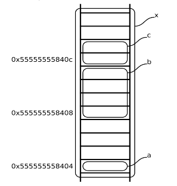

# Ponteiros

Os tipos básicos são representados em memória por grupos de células de memória.

Um ponteiro é um grupo de células capaz de guardar um endereço de memória.

Na arquitectura x86_64 um ponteiro tem a dimensão de 8 bytes

O **operador &** aplica-se a uma variável e serve para obter o ponteiro para essa varável (o seu endereço em memória).

```C
char c;
char * p = &c;
```

O **operador \*** aplica-se a um ponteiro e acede ao valor apontado (conteúdo de). Operador desreferenciação.

Sendo **p** um ponteiro para inteiro, **\*p** representa um inteiro e pode aparecer no lugar de um inteiro.

- **&** ponteiro para
- **\*** conteúdo de

### Ponteiros como argumentos de funções

A linguagem C só tem passagem de parâmetros por valor

O tipo ponteiro permite passar, como valor de um parâmetro, a refrência de uma variável (endereço).

Através desse ponteiro pode-se aceder ao conteúdo da variável, simulando-se assim a passagem por referência

```c
void swap(int *pa, int *pb) {
	int aux = *pa;
	*pa = *pb;
	*pb = aux;
}
int a = 22, b = 33;
int main() {
	swap(&a, &b);
}
```

### Ponteiros e arrays

```c
int a[10], *p;
```

O identificador do array **a** é equivalente ao ponteiro para a primeira posição - **&a[0]**

**p = a** é equivalente a **p = &a[0]**

As operações sobre *arrays* com operador indexação podem ser escritas com notação de ponteiros

|                           | acesso a conteúdo | ponteiros para posições do *array* |
| ---- | ---- | ----- |
operador indexação | a[0]  a[1]  a[i] | &a[0]  &a[1]  &a[i] |
notação de ponteiro | \*a   \*(a + 1)  \*(a + i) | a   a + 1   a + i |

**a** não é uma variável, é um valor do tipo ponteiro. Não é possível **a++** ou **a = p**

**Exemplo**

Ordenar um *array* de inteiros

```c
#define ARRAY_SIZE 9

void sort(int array[], size_t size) {
	for (size_t i = 0; i < size - 1; i++) {
		for (size_t j = 0; j < size - i - 1; ++j) {
			if (array[j] > array[j + 1])
				swap(&array[j], &array[j + 1]);
		}
	}
}
void print(int array[], size_t size) {
	putchar('\n');
	for (size_t i = 0; i < size - 1; i++) {
		printf("%d ", array[i]);
	}
	putchar('\n');
}
int array[] = {1, 2, 20, 4, 5, 30, 10, 34, 22};

int main() {
	print(array, ARRAY_SIZE);
	sort(array, ARRAY_SIZE);
	print(array, ARRAY_SIZE);

	return 0;
}
```

Alternativa usando a notação de ponteiro. (O uso de ponteiros pode eventualmente ser melhor)

```c
void sort(int *array, size_t size) {
	for (size_t i = 0; i < size - 1; ++i)
		for (int *p = array; p < array + size - i - 1; ++p) {
			if (*p > *(p + 1)
				swap(p, p + 1);
		}
}
```

A cópia de *arrays* não pode ser feita assim:

```c
int values[] = {34, 40, 36, 36, 37, 33, 33, 32};
int buffer[100];
buffer = value;  // ERROR!!!
```

**buffer** e **value**, sem o operador indexação, equivalem aos ponteiros para a primeira posição dos *arrays*.

A cópia tem de ser feita elemento a elemento.

### Ponteiros para caracteres

- **char message[] = "texto para teste";** - *array* de caracteres
- **char * pmessage = "text para teste";** - ponteiro para *array* de caracteres com atributo de constante

**message[i]** dá acesso ao mesmo caracter que **pmessage[i]**

## String

Em C, *string*, é equivalente a um *array* de caracteres terminado por ```\0```.

### Array como argumento de funções

Quando se passa um *array* como argumento de função efetivamente está-se a passar o ponteiro para a primeira posição. Internamente à função, o parâmetro é suportado numa variável local do tipo ponteiro.

- **void to_upper(char str[])** é equivalente a **void to_upper(char *str)**
- **to_upper("uma string constante");** - *string* constante
- **to_upper(array);** - *array* de caracteres - **char array[10]**
- **to_upper(prt);** - variável do tipo ponteiro - **char *ptr**

## Aritmética de ponteiros

**Princípio básico** - se **p** é um ponteiro para um elemento de um array então **p + 1** é um ponteiro para o elemento seguinte.

Admitindo que a unidade de endereçamento da arquitectura de processador é o *byte*. Se o tipo **char** ocupar um *byte* em memória **p + 1** incrementa o endereço de uama unidade. Se o tipo **float** ocupar quatro *bytes* em memória, **p + 1** incrementa o endereço de quatro unidades.

- **p++** pós-incrementa **p** o número de *bytes* igual á dimensão de um elemento
- **++\*p** pré-incrementa o valor apontado por **p**
- **\*++p** pré-incrementa o ponteiro e depois desreferencia-o acedendo ao valor apontado
- **\*p++** desreferencia o ponteiro acedendo ao elemento apontado e depois incrementa o ponteiro
- **p - q** representa o número de elementos entre os ponteiros **p** e **q**

Não é possível realizar outras operações sobre ponteiros. Por exemplo, não é possível somar dois ponteiros.

## Ponteiros tipo *void*

Um ponteiro para **void** não pode ser desreferenciado, somado o subtraido, porque o elemento apontado é indefinido.

Por omissão, o compilador **gcc** trata o ponteiro para *void* como ponteir para *char* para efeito de aritmética de ponteiros. (Não está segundo a norma).

Uma variável do tipo ponteiro para *void* pode receber ponteiros de qualquer tipo. Assim como afetar ponteiros de qualquer tipo.

## Array bidimensional

- **char a[6] = "abcd";** - **a** é um *array* cujos elementos são caracteres
- **char a[][5] = {"luis", "rui", "ana"};** - **a** é um *array* cujos elementos são *arrays* de caracteres

## Array de ponteiros

- **char *a[] = {"luis", "rui", "ana"};** - **a** é um *array* cujos elementos são ponteiros para *array* de caracteres

### Struct

O tipo **struct** agrega variáveis de tipos diferentes

- Declaração do tipo:
	
```c
	struct pessoa {
		char nome[100];
		int idade;
		int peso;
		float altura;
	}
	```

- Definição de variável do tipo *struct*:

```c
struct pessoa utente;
```

- Para simplificar a escrita pode-se usar *typedef* e escrever o nome deste em vez de *struct pessoa*:

```c
typedef struct pessoa Pessoa;

Pessoa eu;
```

- Acesso a membro (<nome da struct>.<membro>):

```c
eu.idade;
```

- As *structs* podem-se copiar com o endereço afetação:

```c
Pessoa a, b;
a = b;
```

- A passagem de *struct* como argumento de função é feita por valor

```c
int imc(struct pessoa p) {
	return p.peso / (p.altura * p.altura)
}
```

- Retorno da *struct* como valor de uma função

```c
struct pessoa pessoa_nova(char n[], int i, int p, int a){
	struct pessoa temp;
	strcpy(temp.nome, n);
	temp.idade = i;
	temp.peso = p;
	temp.altura = a;
	return temp;
}
```

- Inicialização na definição

```c
struct pessoa pessoa1 = {"António", 53, 80, 1.76};
struct pessoa pessoa2 = {
	.nome = "José",
	.altura = 1.76,
	.peso = 80,
	.idade = 23
};
```

### Ponteiros e *structs*

Se for necessário passar uma estrutura muito grande para uma função, deve-se considerar a passagem por ponteiro

```c
int imc(struct pessoa *p){
	return (*p).peso / ((*p).altura * (*p).altura);
}
```

A linguagem C dispõe de um operador alternativo para aceder ao membro de uma *struct* baseado em ponteir: ```->```

```c
return p->peso / (p->altura * p->altura);
```

Os operadores ```.``` e ```->``` em conjunto com ```()``` e ```[]``` são os mais prioritários:

```c
struct pessoa{
	char nome[100];
	int idade;
	int peso;
	int altura;
} *p;
```

- ```++p->idade``` - incrementa o membro **idade**
- ```(p++)->idade``` - incrementa **p** depois de aceder a **idade**. Só faz sentido num *array* de pessoas
- ```*p->nome``` - dá acesso ao primeiro caracter de **nome**
- ```p++->nome``` - incrementa **p** depois de aceder ao primeiro caracter de **nome**
- ```(*p->nome)++``` - incrementa o código do primeiro caracter de **nome**

### Alojamento de *struct* em memória

Considerando a seguinte defenição da variável **x**:

```c
struct y {
	char a;
	int b;
	short c;
} x;
```

- Os membros de uma *struct* são dispostos em memória seguindo as regras de alinhamento do tipo a que pertencem, mesmo que para isso seja necessário inutilizar posições de memória entre campos consecutivos
- O endereço de início da *struct* é alinhado no maior alinhamento necessário a um dos seus campos.
- A dimensão de uma *struct* é múltipla do seu alinhamento

Num processador a 32 ou 64 bits, com o compilador GNU, para alinha o campo **b**, é necessário avançar três posições de memória. A dimensão total desta *struct* é de 12 bytes.



### Structs com campos baseados em bits

Justificação:

- casos em que se pretende reduzir a memória ocupada;
- acesso a bits de forma simplificada.

**Exemplo 1:**

```c
struct date {
	short day: 5;
	short month: 4;
	short year: 7;
};

struct date date_pack(int year, int month, int day){
	struct date tmp = {year - 2000, month, day};
	return tmp;
}

sizeoff(struct date); // 2, o mesmo que sizeoff(short)
```

**Exemplo 2:**

Acesso a registo de periférico mapeado no espaço de memória

```c
struct register_status{
	char counter_enable: 1;
	char counter_reset: 1;
};

struct register_status *status = 0xE0008004;

status->counter_enable = 1;
```

Como a unidade mínima de acesso à memória é a palavra de memória - **byte**, para afetar um número de bits inferior é necessário ler, alterar os bits desejados e voltar a escrever. Resultado em dois acessos à memória, um de leitura e um de escrita.

Apesar de aparente vantagemem relação à utilizaçãoo de operadores lógicos bit-a-bit, nem sempre é conveniente a sua utilização:

1. Se, no acesso a um registo de periférico, este for só de escrita a operação de leitura é inútil
2. Se a operação de leitura sobre um registo de periférico provocar a alteração de estado do periférico, ela é certamente indesejada.

## Union

Uma **union** é uma variável que pode armazenar, em tempos diferentes, valores de diferentes tipos e tamanhos. Através de uma *union* é possível encarar um dado conteúdo de memória na perspectiva de diferentes tipos

```c
struct symbol{
	char *name;
	int flags;
	union {
		int value_int;
		float value_float;
		char *value_string;
	}
	
}
```

## Avaliação de desempenho

### Medida de tempo

```c
#include <time.h>

unsigned int get_time(){
	struct timespec ts;
	clock_gettime(CLOCK_MONOLITIC, &ts);
	return ts-tv_sec * 1000 + (ts.tv_nsec / 1000000);
}
unsigned initial = get_time();

unsigned elapsed = get_time() - initial;
```