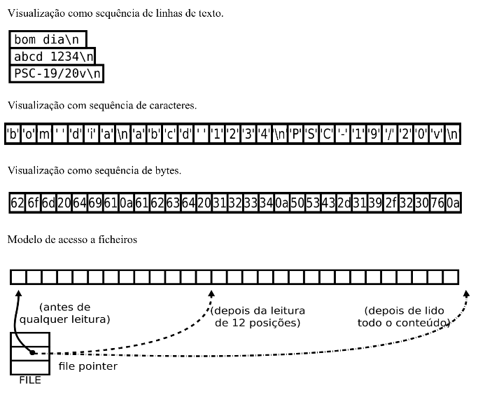

# Standard Input and Output

## Modelo de ficheiro



O conteúdo de um ficheiro pode ser interpretado em modo de texto "**t**" ou em modo binário "**b**". Em modo binário o ficheiro é encarado como uma sequência de bytes indiferenciados. Em modo de texto, é encarado como uma sequência de linhas de texto, em cada linha é formada por uma sequência de caracteres imprimíveis e treminada por um mercador de fim de linha. No Unix o marcador é o caracter ```\n```, no Windows, o marcador é a sequência ```\n\r```.

Todos os ficheiros, incluindo os que têm texto, podem ser interpretados em binário.

As transferências de dados entre a memória e o ficheiro processam-se a partir de um indicador de posição associado ao ficheiro (*file pointer*). O indicador de posição avança automaticamente após cada operação de transferência de um número igaul ao número de *bytes* transferidos.

Na operação de abertura, o indicador de posição é colocado no início (opções "r" e "w") ou para além do fim (opção "a").

Existem funções para modificar o indicador de posição de um ficheiro aberto.

## Suportes físicos

Os dispositivos a considerar são:

- ecrã
- teclado
- ficheiros de disco

Os dispositivos são representados por variáveis do tipo ponteiro para FILE (*file descriptor*). No início da execução de um programa, existem disponíveis três destas variáveis que representam o teclado e o ecrã

- **FILE *stdin = &struct_stdin**
- **FILE *stdout = &struct_stdout**
- **FILE *stderr = &struct_stderr**

## Modo texto

O texto é enviado ou recolhido dos dispositivos como uma sequência de linhas. As linhas formadas por caracteres e terminadas por um caracter marcador de fim de linha - **\n**

No ecrã, a escrita do caracter **\n** provoca uma mudança de linha. No teclado, a tecla ```ENTER``` produz o caracter **\n**.

## Output

A escrita é realizada no dispositivo indicado no parâmetro **stream**. Se for **stdout** será no ecrã.

- A função **fputs** escreve a *string* indicada por **s** e acrescenta o caracter **\n**, o que provoca uma mudança de linha.

```c
int fputs(const *s, FILE *stream);
```

- A função **printf** escreve o texto indicado em **format**, substituindo os campos da formatação **%** pela representação dos valores passados nos restantes parâmetros.

```c
int fprintf(FILE *stream, const char *format, ...);
```

- A função **fputch** escreve um caracter

```c
int fputch(int c, FILE *stream);
```

As três funções seguintes equivalem às anteriores com **stdout** como argumento no parâmetros **stream**.

```c
int puts(const char *s);
int printf(const char *format, ...);
int putchar(int c);
```

Para atualizar o ficheiro em disco com dados que estejam em *buffers* intermédios, resultantes de operações de escrita anteriores

```c
int fflush(FILE *stream);
```

Especificações de conversão das funções *printf*:

- **%<flags><width><.precision><leght><conversion>**
- **flags**:
    * **+** imprime o sinal
    * **-** ajuste à esquerda
    * **space** se não for um sinal
    * **0** preencher com zeros
    * **#** modo de escrita alternativa
- **width** dimensão mínima do campo
- **.precision** dimensão máxima para uma string ou casas decimais
- **length**:
	- **h** short
	- **l** long
	- **L** long
- **conversion** d, i, o, x, X, u, c, s, f, e, E, g, G, p, n, %

## Input

A leitura é relaizada do dispisitivo indicado no parâmetro **stream**. Se for **stdin** será do teclado.

```c
char * fgets(char * s, int n, FILE * stream);
```

Lê uma linha de texto. Espera pelo terminador de linha ```\n```. O parâmetro **n** indica a dimensão de memória disponível para receber o texto.

```c
int fscanf(FILE *stream, const char *fromat, ...);
```

Aplica a conversão de texto indicada em **format** à medida que lê os caracteres do dispositivo.

```c
int fgetc(FILE *stream);
```

Lê um caracter

As três funções seguintes equivalem às anteriores com **stdin** como argumento no parâmetro **stream**. A função **gets** não possui o parâmetro que indica a dimensão do *buffer* disponível.

```c
char * gets(char * s);
int scanf(const char *format, ...);
int getchar();
```

Especificações de conversão das funções *scanf*:

- **%*<width><.precision><leght><conversion>**
- **\*** interpreta o campo sem afetar a variável e salta para o próximo
- **width** dimensão máxima do campo
- **length**:
	- **h** short
	- **l** long
	- **L** long
- **conversion** d, i, o, x, u, c, s, f, e, g, p, n, [...], [^...], %

> A definição da função **getchar** em ```stdio.h``` é equivalente a: ```int getchar() { return fgetc(stdin); }```

## Redirecionamento

As variáveis **stdin** e **stdout** que representam normalmente o teclado e o ecrã podem representar ficheiros em disco.

Essa substituição pode ser feita na invocação do programa na linha de comando do interpretador de comandos (*shell*).

O sinal **>** substitui, em **stdout**, o *file descriptor* do ecrã pelo ficheiro que se indicar.

O sinal **<**, substitui, em **stdin**, o *file descriptor* do teclado pelo do ficheiro qie se indicar.

Exemplos:

- o programa **program** ao ler de **stdin** está efetivamente a ler do ficheiro **myfile**.

```bash
$ program < myfile
```

- o programa **program2** lê de **text1** e escreve em **text2**, ao usar, respetivamente, os ponteiros **stdin** e **stdout**

```bash
$ program2 < text1 > text2
```

## Ficheiros

Para que as funções anteriores acedam a um dado ficheiro em disco é necessário que o argumento passado no parâmetro **stream** esteja associado a esse ficheiro. Essa associação é realizada pela função **fopen**.

```c
FILE *fopen(const char *filename, const char *mode);
```

Esta função procura, no sistema de ficheiros, pelo ficheiro indicado no parâmetro **filename** e cria uma representação interna desse ficheiro (**FILE**)..

Modos de abertura do ficheiro:

- **r** - só ler
- **w** - só escrever
- **a** - escrever no final (*append*)

Sinal **+** significa abrir em modo de atualização:

- **r+** - ler e escrever
- **w+** - ler e escrever, começa vazio
- **a+** - escrever no fim, ler em qualquer lado

Quando um ficheiro é aberto em modo de atualização deve-se usar **fflush**, **fseek** e **fsetpos** entre as escritas e as leituras para posicionar o indicador de posição.

- A função **fclose** garante atualização do ficheiro no sistema de ficheiros com eventuais dados em trânsito, e elimina a representação interna do ficheiro. A partir desse momento, o ficheiro deixa de acessível. Ao terminar um processo, o sistema operativo executa esta função para todos os ficheiros abertos.

```c
int fclose(FILE * stream);
```

- A função **remove** serve para eliminar um ficheiro

```c
int remove(const char * filename);
```

- A função **rename** serve para alterar o nome de um ficheiro

```c
int rename(const char * oldname, const char * newname);
```

- A função **tmpfile** cria um ficheiro temporário anónimo

```c
FILE *tmpfile(void);
```

- A função **tmpnam** cria um nome de ficheiro diferente de qualquer outro existente no sestema de ficheiros

```c
char * tmpnam(char S[L_tmpnam]);
```

## Posicionamento

As funções seguintes permitem manipular o indicador de posição

```c
int fseek(FILE *stream, long offset, int whence);
```

- **SEEK_SET** - posiciona na posição indicada
- **SEEK_CUR** - posiciona em relação à posição corrente
- **SEEK_END** - posiciona em relação ao fim

```c
void rewind(FILE * stream);
```

### Binário

Em formato binário, um ficheiro é encarado como uma sequência de *bytes*

### Output

- Escrever no ficheiro representado por *stream*, uma sequência de items com dimensão *nitems* tendo cada item a dimensão *size* em *bytes*. Esta operação transfere um bloco de dimensão *nitems \* size byte* para a memória, a partir da posição *ptr*

```c
size_t fwrite(const void * ptr, size_t size, size_t nitems, FILE * stream);

int fputc(int c, FILE *stream);
```

- Atuaizar o ficheiro com dados que estejam em *buffers* intermédios, resultantes de operações de escrita anteriores

```c
int fflush(FILE * stream);
```

### Input

- Ler do ficheiro representado por *stream*, uma sequência de items com dimensão *nitems*, tendo cada item a dimensão *nitems \* size byte* da memória, a partir da posição *ptr*

```c
size_t fread(void * ptr, size_t size, size_t nitems, FILE * stream);

int fgetc(FILE *stream);
```