# Programação Assembly x86_64

## Processador x86_64

### Registos

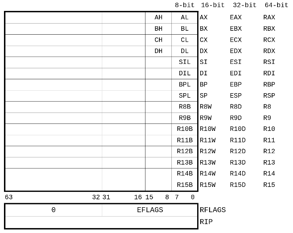

### Flags

| 0 | 0 | 0 | 0 | 0 | 0 | 0 | 0 | 0 | 0 | 0 | 0 | 0 | 0 |VM|RF| 0|NT|IOPL|OF|DF|IF|TF|SF|ZF|0 |AF| 0|PF| 1|CF|
| - | - | - | - | - | - | - | - | - | - | - | - | - | - | - | - | - | - | -- | - | - | - | - | - | - | - | - | - | - | - | - |
| 31|   |   |   |   |   |   |   |   |   |   |   |   |   | 17| 16| 15| 14| 13 12| 11| 10| 9 | 8 | 7 | 6 | 5 | 4 | 3 | 2 | 1 | 0 |

- **CF** - Carry Flag
- **PF** - Parity Flag
- **AF** - Auxiliary Flag
- **ZF** - Zero Flag
- **SF** - Sign Flag
- **TF** - Trap Flag
- **IF** - Interrupt Flag
- **DF** - Direction Flag
- **OF** - Overflow Flag
- **IOPL** - I/O Priviledge Flag
- **NT** - Nested Task Flag
- **RF** - Resume Flag
- **VM** - Virtual 8086 Mode

### Organização dos dados em memória

Designação dos tipos de palavra na terminologia *Intel*

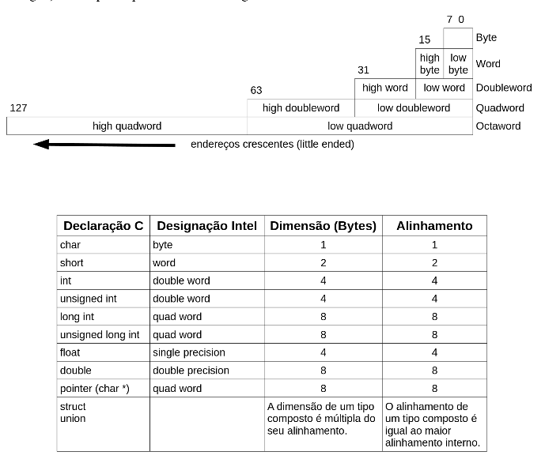

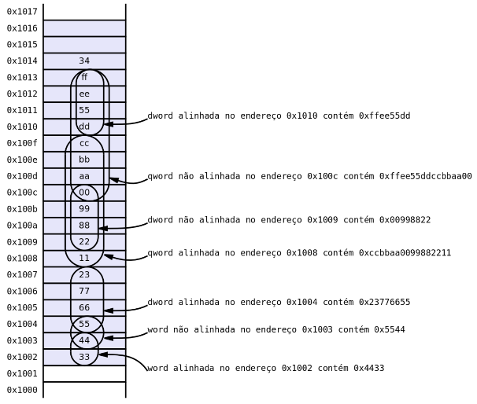

### Instruções (comparação com o P16)

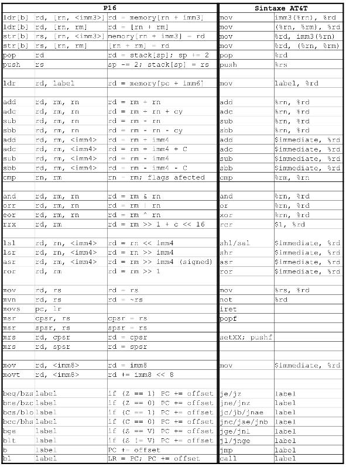

## Assembly x86_64

### Sintaxe

- **Sintaxe Intel** - o **primeiro** argumento de uma instrução é o destino do resultado e o primeiro operando

```assembly
mov 	rax, 100
```

- **Sintaxe AT&T** - o **segundo** argumento de uma instrução é o destino do resultado e o primeiro operando

```assembly
mov 	$100, %rax
```

### Instruções

Formato geral das instruções: **<intrução>	<operando2>, <operando1/destino>**

### Operandos

Os operandos são valores representados a 8, 16, 32 ou 64 bits

Os operandos são definidos como:

- valores **imediatos** ```mov 	$1, $rax```
- valores em **registo** ```sub  %rcx, %rdx```
- ou valores em **memória** ```add  %rax, (%rbx)```

Há instruções com operandos implícitos: ```div```, ```mul```, ```inc```, etc.

Um operando fonte pode ser um valor **imediato**, um valor em **registo** ou um valor em **memória**. Um operando destino apenas pode ser um registo ou uma posição de memória. **Não existem instruções que operem dois operandos em memória**: ```sub  (%rdx), (%rbx)

#### Operandos em memória

Um operando em memória é definido por 4 componentes:

**displacement(base register, index register, scale)**

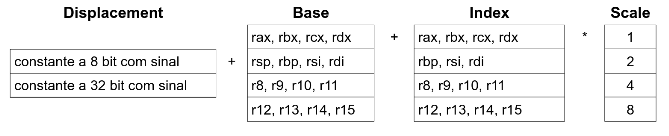

Exemplos de definição de operandos:

| Sintaxe | Valor  | Designação | Exemplo |
| ------- | ------  | ---------- | ------- |
| $Imm    | Imm    | Imediato   | ```mov $20, %r10``` |
| ra      | R[ra]  | Registo    | ```mov rax, %r10``` |
| Imm     | M[Imm] | Directo ou absoluto | ```mov var %rax``` |
| (ra)    |M[R[ra]]| Indireto   | ```mov (%r10), rax``` |
| Imm(rb) |M[Imm + R[rb]]|Baseado| ```mov 2(%r12), rax``` |
| (rb, ri)|M[R[rb] + R[ri]]| Indexado|```mov (%rcx, %r12), rax```|
|Imm(rb, ri)|M[Imm + R[rb] + R[ri]]|Indexado|```mov count(%rcx, %r12), rax```|
|(, ri, s)|M[R[ri] * s]|Indexado escalado|```mov (, %r12, 4),rax```|
|Imm(, ri, s)|M[Imm + R[ri] * s]|Indexado escalado|```mov array(, %r12, 2), rax```|
|(rb, ri, s)|M[R[rb] + R[ri] * s]|Indexado escalado|```mov (%r14, %r12, 2), rax```|
|Imm(rb, ri, s)|M[Imm + R[rb] + R[ri] * s]|Indexado escalado|```mov array(%rdx, %r12, 8), rax```|

> Na definição de operandos em memória alguns componentes podem ser omitidos

No acesso a variáveis em memória usa-se endereçamento indireto com base em ```RIP```: **displacement(%rip)**

O ISA também dispõe de endereçamento direto com endereços definidos a 64 bit.

```assembly
	mov		$0x80001000, %rbx
	mov		(%rbx), %rcx
	and		$0x00ff00ff, %rcx
	mov		%rcx, 4(%rbx)
	mov		$0, %rdx
L1:
	mov		12(%rbx, %rdx), %al
	sub		$' ', %al
	mov		%al, 12(%rbx, %rdx)
	inc		%rdx
	cmp		$3, %rdx
	jnz		L1
```

| Memory address | value |
| -------------- | ----- |
| 0x8000100e     | 'g'   |
| 0x8000100d     | 'f'   |
| 0x8000100c     | 'e'   |
| 0x8000100b     | 'd'   |
| 0x8000100a     | 'c'   |
| 0x80001009     | 'b'   |
| 0x80001008     | 'a'   |
| 0x80001007     |  88   |
| 0x80001006     |  77   |
| 0x80001005     |  66   |
| 0x80001004     |  55   |
| 0x80001003     |  44   |
| 0x80001002     |  33   |
| 0x80001001     |  22   |
| 0x80001000     |  11   |


### Lista de Instruções (sintaxe AT&T)

#### Instruções para movimento de dados

 - **mov <origem>, <destino>**

Copia **origem** para **destino**. A origem pode ser um valor imediato, o conteúdo de um registo ou de uma posição de memória. O destino pode ser um registo ou posição de memória.

| Instrução           | efeito              |
| ------------------- | ------------------- |
| ```mov  $0, %rax``` | **rax** é afetado com 0 |
| ```mov $rbx, %rax``` | **rax** é afetado com o valor de **rbx** |
| ```mov var, %rax``` | **rax** é afetado com o valor da variável **var** |
| ```mov  (%rbx), %rax``` | **rax** é afetado com o valor em memória cujo enderenço está em **rbx** |

 - **movzx / movsx <origem, destino>**

Copia um valor representado a 8, 16 ou 32 bits para um destino representado com maior número de bits. Os bits de maior peso são acrescentados com zero ou com bit de sinal.

- **xchg <operando1>, <operando2>**

São torcados os conteúdos dos registos ou posições de memória entre **operando1** e **operando2**. Não é possível trocar o conteúdo de duas posições de memória na mesma instrução.

Trocar o conteúdo de duas *quadwords* em memória:

```assembly
mov  (%rbx), %rax
mov  8(%rbx), %rcx
mov  %rcx, (%rbx)
mov  %rax, 8(%rbx)
```

é equivalente a:

```assembly
mov  (%rbx), %rax
xchg 8(%ebx), %rax
mov  %rax, (%rbx)
```

- **cbw / cwd / cdq**

Converte um valor para uma representação com maior número de *bits*, assumindo codifocação em código de complementos (operandos implícitos).

```assembly
cbw  - al				# para ax
cwd  - ax				# para eax
cdq  - eax				# para edx:eax
```

- **lea <origem>, <destino>**

```assembly
lea   var(%rip), %rax		# colocar em rax o endereço da variável var
lea   (%rbx, %rdi), %rax	# colocar em rax o endereço que resulta da soma re rbx com rdi
```

- Exemplos:

```c
int a, b;
a = b;
```

```assembly
a:		.int 0
b:		.int 0

mov 	b(%rip), %eax
mov		%eax, a(%rip)
```

----

```c
char c, d, *p;

p = &c;

*p = d;
```

```assembly
c:		.byte 0
d: 		.byte 0
p:		.long 0

lea		c(%rip), %rbx
mov		%rbx, p(%rip)

mov		d(%rip), %al
mov		p(%rip), %rbx
mov 	%al, (%rbx)
```

----

```c
int array[] = {1, 2, 3};
int i = 2;
int *pi;

array[i] = 6023;

pi = &array[i];
```

```assembly
array: 		.int 1, 2, 3
i			.int 2
pi:			.quad 0

mov 		i(%rip), %rcx
lea			array(%rip), %rax
mov			$6023, (%rax, %rcx, 4)

lea			array(%rip), %rax
mov			i(%rip), %rcx
lea	  		(%rax, %rcx, 4), %rdx
mov			%rdx, pi(%rip)
```

- **push <operando>**

Decrementa o registo **rsp** de 8 e copia o **operando** para a posição de memória definido por **rsp**. O **operando** pode ser um valor imediato, um valor em registo ou nume posição de memória.

```assembly
push 		%rdx

# é equivalente a:
sub 		$8, %rsp
mov			%rdx, (%rsp)

# exemplos:
push		%rax
push		$0x800000000a080
push		(%rbx)
```

- **pop <operando>**

Copia o valor da posição de memória indicada por **rsp** para o **operando** e incrementa o registo **rsp** de 8. O **operando** pode ser um registo ou numa posição de memória.

```assembly
pop			%rdx

# é equivalente a:
mov 		(%rsp), %rax
add			$8, %rsp

# Exemplos:
pop			%rdx
pop			var(%rbx)
```

#### Instruções aritméticas

- **add <operando2>, <operando1 / destino>**

Adiciona o valor do **operando1** com o **operando2** e coloca o resultado em **operando1**. O **operando2** pode ser um valor imediato, um registo ou uma posição em memória. O **operando1** pode ser um registo ou uma posição de memória.

```assembly
add			%rbx, %rax		# afeta rax com rax + rbx
add			$10, 4(%rbx)	# adiciona 10 a um valor em memória. O endereço do operando em memória è calculado pela adição de rbx com 4
```

- **adc <operando2>, <operando1 / destino>**

Adiciona o valor **operando1** com o do **operando2** e com **flag de carry**. Coloca o resultado em **operando1**. O **operando2** pode ser um valor imediato, um registo ou uma posição de memória, o **operando1**, apenas pode ser um registo ou uma posição de memória.

Somar valores representados a 128 bits - primeira parcela em **rbx:rax**; segunda parcela em **rdx:rcx**; resultado em **rbx:rax**

```assembly
add			%rcx, %rax
adc			%rdx, %rbx
```

- **sub <subtraendo>, <diminuendo / destino>**

Subtrai **subtraendo** de **diminuendo** e coloca o resultado em **destino** que é coicidente com **diminuendo**. O **subtraendo** pode ser um valor imediato, um registo ou uma posição de memória. O **diminuendo** pode ser um registo ou uma posição de memória.

```assembly
sub			%rbx, %rax		# afeta rax com rax - rbx
```

- **sbb <subtraendo>, <diminuendo / destino>**

Subtrai **subtraendo** e a **flag carry** de **diminuendo**. O **subtraendo** pode ser um valor imediato, um registo ou uma posição de memória. O **destino / diminuendo** pode ser um registo ou uma posição em memória. É assumido que a *flag carry* contém a indicação *borrow* resultante de uma subtração anterior.

Subtrai valores representados a 128 bits - diminuendo em **rbx:rax**; subtraendo em **rax:rcx**; resultado em **rbx:rax**

```assembly
sub 		%rcx, %rax
sbb			%rdx, %rbx
```

- **inc <operando>**

Incrementa uma unidade ao **operando**. O **operando** pode ser um registo ou uma posição de memória

```assembly
inc			%rax		# afeta rax com rax + 1
```

- **dec <operando>**

Decrementa uma unidade ao **operando**. O **operando** pode ser um registo ou uma posição de memória

```assembly
dec			%rax		  # afeta rax com rax - 1
decl		(%rbx, %rcx)  # decrementa uma unidade a um valor de memória
						  # O endereço de memória é dado pela adição de rbx + rcx
						  # O sufixo de dec indica a dimensão do operando
```

- **neg <operando>**

Nega o valor numérico representado no **operando**. O **operando** pode ser um registo ou uma posição em memória

```assembly
neg 		%rax  		# simetrico do valor de rax
```

- **mul <operando>**

Multiplica o argumento da instrução pelo valor de `al`, `ax`, `eax` ou `rax` deixando o resultado em `ax`, `eax` ou `rax`, respetivamente.

- **div <operando>**

Divide o conteúdo de `ax`, `dx:ax`, `edx:eax`, ou `rdx:rax` por **operando** deixando os resultados (quociente e resto) em `al - ah`, `ax - dx`, `eax - edx` ou `rax - rdx`. 

#### Instruções lógicas

- **and <operando2>, <operando1 / destino>**

Executa a operação lógica **AND** entre os *bits* da mesma posição de ambos os operadores. Coloca o resultado em destino.

- **or <operando2>, <operando1 / destino>**

Executa a operação lógica **OR** entre os *bits* da mesma posição de ambos os operandos. Coloca o resultado em destino.

- **xor <operando2>, <operando1 / destino>**

Executa a operação lógica **EXCLUSIVE_OR** entre os *bits* da mesma posição de ambos os operandos. Coloca o resultado em destino.

- **not <operando>**

Inverte o valor lógico de todos os *bits* de operando. O operando pode ser um registo ou uma posição de memória.

#### Instruções de deslocamento (*shift*)

- **sal/shl <nbits>, <operando>**

Desloca o conteúdo de **operando** para a esquerda inserindo *zero* nos bits de menor peso.

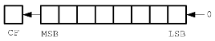

- **sar <nbits>, <operando>**

Desloca o conteúdo de **operando** para a direita propagando o valor do *bit* de maior peso.

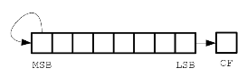

- **shr <nbits>, <operando>**

Desloca o conteúdo de **operando** para a direita inserindo zero nos *bits* de maior peso.

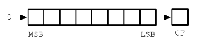

- **shld <nbits>, <operando1>, <operando2>**

Desloca os conteúdos de **operando1** e **operando2** para a esquerda inserindo os *bits* de menor peso de **operando1** nos de maior peso de **operando2**. Apenas o **operando2** é alterado, o **operando1** mantém-se.

- **shrd <nbits>, <operando1>, <operando2>**

Desloca os conteúdos de **operando1** e **operando2** para a direita inserindo os *bits* de menor peso de **operando1** nos de maior peso de **operando2**. Apenas o **operando2** é alterado, o **operando1** mantém-se.

- **ror <nbits>, <operando>**

Desloca o conteúdo de operando para a direita inserindo, em cada passo, o bit de menor peso na posição de maior peso e na *carry flag*

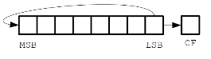

- **rol <nbits>, <operando>**

Desloca o conteúdo de operando para a esquerda inserido, em cada passo, o bits de maior peso na posição de menor peso e na *carry flag*

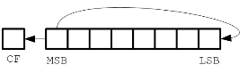

- **rcr <nbits>, <operando>**

Desloca o conteúdo de operando para a direita inserindo, em cada passo, o bit de menor peso na *carry flag* e o conteúdo da *carry flag* na posição de maior peso

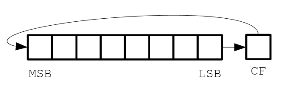

- **rcl <nbits>, <operando>**

Desloca o conteúdo de operando para a esquerda inserindo, em cada passo, o bit de maior peso na *carry flag* e o conteúdo da *carry flag* na posição de menor peso

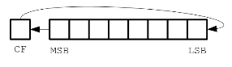

##### Exemplos

Considerando **a** um valor expresso a 64bit, previmente carregado em RAX

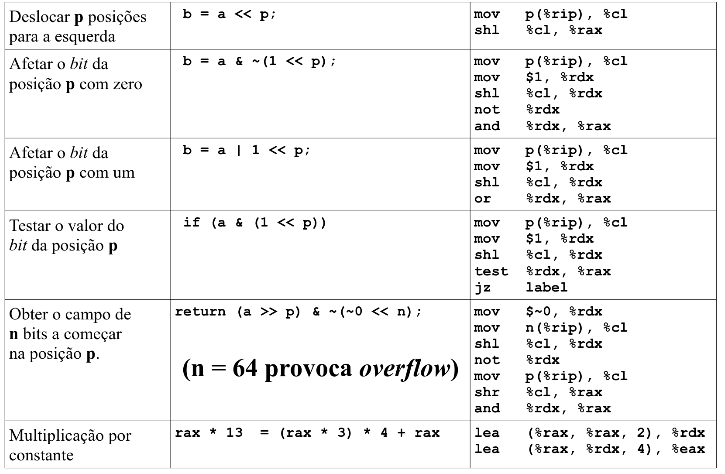

Considerando **a** um valor expresso a 128bit previamente carregado em RDX:RAX

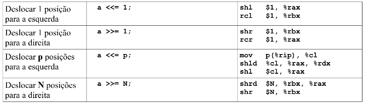

#### Instruções para controlo de execução

- **jmp <endereço>**

Executa o salto para o endereço definido pelo argumento da instrução. O endereço pode ser definido em absoluto, através de um valor imediato, pelo conteúdo de um registo ou de uma posição de memória, ou pode ser definido de forma relativa, através de um valor imediato ao valor corrente do RIP.

|   Instrução   | Notas |
| ------------- | ----- |
| **jmp  .L2**  | .L2 representa um valor constante |
| **jmp  \*%rax** | salta para o endereço que está em RAX |
| **jmp  \*(rbx)** | salta para o endereço que em memória no endereço indicado por RBX |

 - **call <endereço>**

Guarda RIP no *stack* (push %rip). Nessa altura RIP contém o endereço da instrução seguinte. Depois executa o salto para o endereço indicado (jmp <endereço>). O endereço de salto pode ser um valor imediato, o conteúdo de um registo ou de uma posição de memória.

**call <endereço>** é equivalente a **push %rip** seguido de **jmp <endereço>**

- **ret**

Coloca o valor que está no topo do *stack* em RIP (pop %rip). Sendo o valor que está no topo do *stack* o endereço empilhado pela última instrução **call**, esta instrução provoca o retorno do processamento à instrução a seguir aessa instrução **call**.

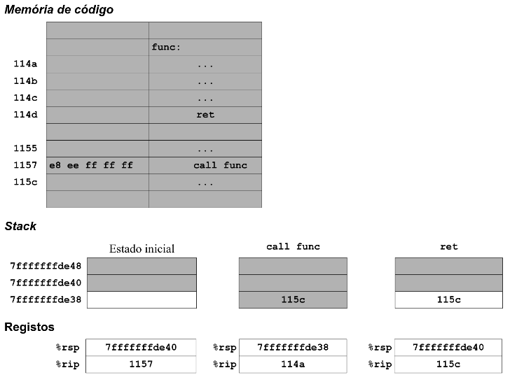

- **enter**

Na sua forma básica, é equivalente a:

```assembly
push %rbp
mov  %rsp, %rbp
```

É usada no início das funções para preparar a *stack frame*

- **leave**

É equivalente a:

```assembly
mov  %rbp, %rsp
pop  %rbp
```

É usada no finm das funções para restaurar o *stack pointer* e o *base pointer*

##### Exemplo

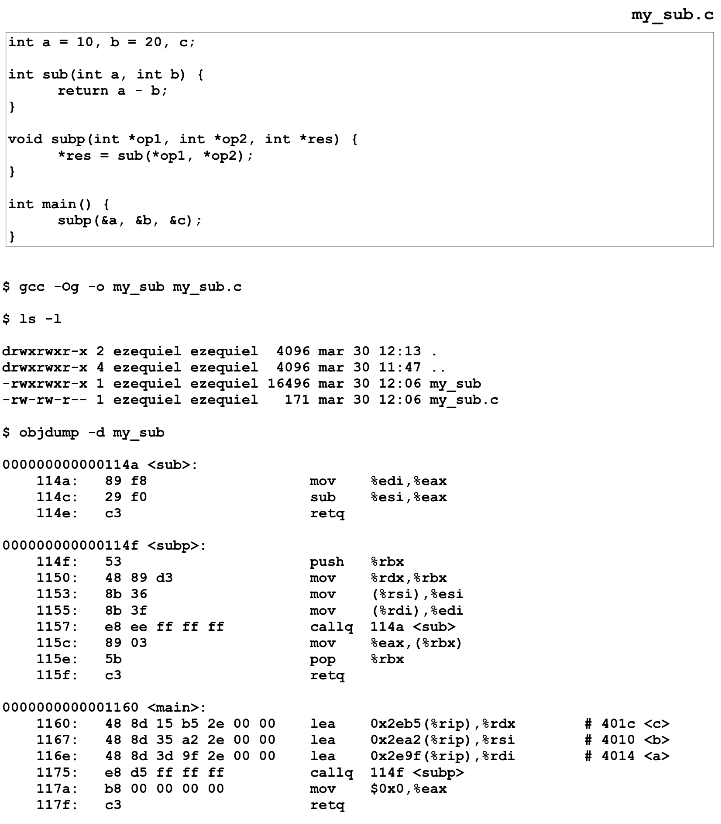

#### Instruções sobre blocos de memória

- **movs**

Move o conteúdo da memória indicada por RSI para a memória indicada por RDI

- **cmps**

Compara o conteúdo da memória indicada por RSI com o conteúdo da memória indicada por RDI

- **scas**

Compara o conteúdo de RAX com o conteúdo da memória pontada por RDI

- **rep repe repz repne repnz**

Prefixos de repetição. Provocam a repetição da operação da instrução seguinte enquanto o registo RCX for maior que zero e se verificar a condição indicada

#### Instruções relacionadsa com *flags*

- **test <operando2>, <operando1>**

Executa a operação lógica AND entre os bits das mesmas posições dos operandos. Não aproveita o resultado mas afeta as *flags*

```assembly
# Testa o valor do bit 7 - executa EAX & 0x80 e afeta as flags
test $0x80, %eax
jz   label
```

- **cmp <subtraendo>, <diminuendo>**

Subtrai **subtraendo** ao **diminuendo**. O resultado não é aproveitado, apenas as *flags* são afetadas. O **subtraedo** pode ser um valor imediato, um registo, ou uma posição de memória. O **diminuendo** pode ser um registo ou uma posição de memória.

```assembly
cmp  %ebx, %eax         # realiza EAX - EBX e afeta as flags
```

- **j<cond> <endereço>**

Se a condição for verdadeira, muda o endereço de execução para o endereço definido pelo argumento. A verificação da condição é realizada sobre o estado das *flags*. O endereço de salto é definido de forma relativa, através de um valor imediato a adicionar ao valor corrente de RIP

Encarando os operandos como números naturais

| Mnemonica    | Condition tested | jump if... |
| ------------ | ---------------- | ---------- |
| **ja/jnbe**  | (CF or ZF) = 0   | above / not bellow nor equal |
| **jae/jnb**  | CF = 0           | above or equal / not bellow |
| **jb/jnae**  | CF = 1           | bellow / not above nor equal |
| **jc**       | (CF or ZF) = 1   | carry |
| **je/jz**    | ZF = 1           | equal / zero |
| **jnc**      | CF = 0           | not carry |
| **jne/jnz**  | ZF = 0           | not equal / not zero |
| **jnp/jpo**  | PF = 0           | not parity / parity odd |
| **jp/jpe**   | PF = 1           | parity / parity even |

Encarando os operandos como números relativos

| Mnemonica    | Condition tested | jump if... |
| ------------ | ---------------- | ---------- |
| **jg/jnle**  | ((SF xor OF) or ZF) = 0 | greater / not less nor equal |
| **jge/jnl**  | (SF xor OF) = 0  | greater or equal / not less |
| **jl/jnge**  | (SF xor OF) = 1  | less / not greater nor equal |
| **jle/jng**  | ((SF xor OF) or ZF) = 1 | less or equal / not greater |
| **jno**      | OF = 0           | not overflow |
| **jns**      | SF = 0           | not sign (positive, including 0) |
| **jo**       | OF = 1           | overflow |
| **js**       | SF = 1           | sign (negative) |

### Sintaxe GNU

Um programa é composto por uma sequência de *statements*. Um *statement* começa opcionalmente com uma *label* ao que se segue, também opcionalmente, uma instrução ou directiva, pode ter um comentário e acaba com o fim da linha ou com o caractér separador ';' (ponto e vírgula).

```assembly
label: 
		.directive    	followed by something
another_label:				# this is an empty statement
		instruction		operand_1, operand_2, ....
```

- **label** - símbolo seguido de caractér ':' (dois pontos). Define o endereço do elemento seguinte - instrução ou variável. Pode ser composto por letras, dígitos e os caracteres '.' (ponto) e '_' (underscore). As *labels* locais são definidas por um dígito na forma N: com N de 0 a 9 e referidos por Nb ou Nf.
- **instruction** - qualquer instrução do processador
- **comment** - o caractés '#' indica um comentário até ao final da linha. Podem também ser inseridos comentários como em C com '/\*' no início e '\*/' no fim.

#### Sintaxe Intel

```assembly
mov	rax, rbx
call	[rdi]
shr	rcx, 2
mov 	[rbp + rdi * 4], rax
```

sintaxe geral para operandos em memória - **displacement[base + index * scale]**

#### Sintaxe AT&T

```assembly
movl 	%ebx, %eax
call	*(%edi)
shrl	$2, %ecx
movl	%eax, (%ebp, %edi, 8)
```

Sintaxe geral para operandos em memória - **displacemente(base, index, scale)**

**Sufixos** - as mnem+onicas podem ter sufixo **b**, **w**, **l** ou **q** para indicar, respetivamente, que o operando tem a dimensão de 8, 16, 32 ou 64 bits.

### Expressões

Uma expressão é equivalente a um valor numérico. Esse valor é determinado diretamente, por substituição de um símbolo ou por aplicação de operações a outras expressões.

Uma expressão pode aparecer em qualquer instrução onde seja esperada uma constante

Os valores numéricos podem ser representados em decimal, hexadecimal (0xddd), octal (0ddd), binário (0bddddd) ou caracteres entre '' (plicas). Exemplos: 34, 0x3f, 034, 0b01001, 'K'

#### Operadores unários

- **-** Negação em complemento para 2 (inverso)
- **~** negação bit a bit 

#### Operadores binários


